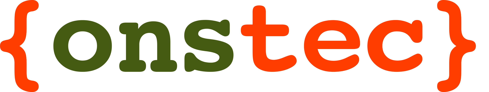
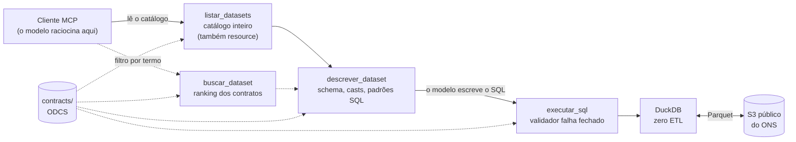

<p align="center">
  
</p>

# MCP TIAGO Dados Abertos — ONS

[](https://github.com/ONSBR/TIAGO-Dados-Abertos/actions/workflows/tests.yml)
[](https://www.python.org/)
[](LICENSE)
[](https://modelcontextprotocol.io/)
[](https://duckdb.org/)
[](https://github.com/bitol-io/open-data-contract-standard)

Servidor [MCP](https://modelcontextprotocol.io/) que dá a um modelo de linguagem acesso aos
[dados abertos do ONS](https://dados.ons.org.br/), o Operador Nacional do Sistema Elétrico.

Uma **camada semântica** em YAML (padrão ODCS) declara schema, unidades e agregações
válidas de cada dataset. O servidor roteia, valida e executa; o modelo do cliente escreve
o SQL. Cada resposta traz unidade e fonte provadas pelo contrato; quando não consegue
provar, omite.

A camada semântica reduz erros do modelo: entrega schema exato, tipos corretos e padrões
SQL validados. Nenhum modelo de linguagem roda no servidor: ele entrega o catálogo e os
contratos, valida e executa o SQL, e tudo o que devolve é determinístico e rastreável ao
contrato.

## Como funciona

O contrato de cada dataset declara também granularidade, casts obrigatórios e as
perguntas que aquele dataset responde. É a única fonte de verdade: não existe configuração
paralela, e tudo o que o servidor afirma sai de um campo do contrato.



- **Roteamento pelo catálogo.** `listar_datasets` entrega o catálogo inteiro, uma linha por
  dataset com granularidade, perspectiva e uso, e o modelo escolhe pelo assunto e pelo grão.
  `buscar_dataset` filtra por termo, com palavra-chave e TF-IDF, para catálogo grande.
  `descrever_dataset` mostra o schema, as unidades e os avisos que o modelo precisa antes
  de escrever SQL.
- **Execução segura.** `executar_sql` aceita só leitura, só das origens do ONS, e devolve o
  resultado com a unidade e a aditividade de cada coluna provadas pelo contrato.
- **Só afirma o que prova.** Quando o contrato não sustenta uma unidade, um total ou uma
  fonte, o servidor omite e diz por quê. Campo ausente é abstenção, não erro.
- **Sem cópia dos dados.** O DuckDB lê o bucket público do ONS no momento da consulta, de
  forma anônima.

Cada resposta de `executar_sql` é a tabela em markdown seguida de até três blocos JSON:
`result-schema`, com a unidade e a aditividade de cada coluna e o tier do contrato que as
provou; `computed-facts`, com os fatos calculados e as abstenções ditas por nome; e
`tiago-dados-abertos-sources`, com o dataset lido e a URL no portal. Bloco que o contrato
não sustenta não aparece.

## Usar sem instalar

O servidor está disponível publicamente em:

```
https://mcp.dados.tiago.ons.org.br/
```

Veja instruções para cada cliente em [dados.ons.org.br/mcp](https://dados.ons.org.br/mcp).

## Instalação

Requisitos: Python 3.11 ou mais recente e acesso à internet. O bucket do ONS é público e
lido anonimamente. O pacote não está no PyPI; a instalação é por clone.

```bash
git clone https://github.com/ONSBR/TIAGO-Dados-Abertos.git
cd TIAGO-Dados-Abertos
python -m venv .venv

# Linux/macOS
source .venv/bin/activate
# Windows
.\.venv\Scripts\activate

pip install -e ".[dev]"
python scripts/build_contracts_cache.py   # acelera o boot; opcional
```

### Rodar

```bash
# STDIO (para IDEs e Claude Desktop)
mcp-tiago-dados-abertos --stdio

# HTTP
mcp-tiago-dados-abertos
# MCP:      http://localhost:8003/mcp
# health:   http://localhost:8003/health
# catálogo: http://localhost:8003/datasets
```

### Docker

```bash
docker build -t mcp-tiago-dados-abertos .
docker run -p 8000:8000 mcp-tiago-dados-abertos
```

Os contratos vão embutidos na imagem e o cache é gerado no build. A porta é 8003 no run
local e 8000 no container: o endpoint MCP do container fica em `http://localhost:8000/mcp`
e o health em `http://localhost:8000/health`. A imagem traz um `HEALTHCHECK` que consulta
esse endpoint a cada 30 segundos.

### Configurar no cliente MCP

Troque `<ABS_PATH>` pelo caminho absoluto do repositório. Em Linux/macOS o comando é
`<ABS_PATH>/.venv/bin/mcp-tiago-dados-abertos`. O arquivo
[`examples/mcp.json`](examples/mcp.json) tem o bloco pronto para copiar.

| cliente | onde | forma |
|---|---|---|
| Claude Desktop | `claude_desktop_config.json` | `mcpServers` com `command` e `args` |
| Claude Code | terminal | `claude mcp add tiago-dados-abertos -- <ABS_PATH>/.venv/Scripts/mcp-tiago-dados-abertos.exe --stdio` |
| Cursor | `.cursor/mcp.json` | `mcpServers` com `command` e `args` |
| Kiro | `.kiro/settings/mcp.json` | `mcpServers` com `command` e `args` |
| Windsurf | `~/.codeium/windsurf/mcp_config.json` | `mcpServers` com `command` e `args` |
| Gemini CLI | `~/.gemini/settings.json` | `mcpServers` com `command` e `args` |
| VS Code | `.vscode/mcp.json` | `servers` com `"type": "stdio"`, `command` e `args` |

Para os clientes com `mcpServers`:

```json
{
  "mcpServers": {
    "tiago-dados-abertos": {
      "command": "<ABS_PATH>/.venv/Scripts/mcp-tiago-dados-abertos.exe",
      "args": ["--stdio"]
    }
  }
}
```

Para o VS Code:

```json
{
  "servers": {
    "tiago-dados-abertos": {
      "type": "stdio",
      "command": "<ABS_PATH>/.venv/Scripts/mcp-tiago-dados-abertos.exe",
      "args": ["--stdio"]
    }
  }
}
```

Com o servidor em modo HTTP ou no container, Cursor, Kiro, VS Code e Claude Code aceitam a
URL no lugar de `command` e `args`: `"url": "http://localhost:8000/mcp"` (porta `8003` fora do
container), no VS Code com `"type": "http"`, e no Claude Code
`claude mcp add --transport http tiago-dados-abertos http://localhost:8000/mcp`.

## Tools

| tool | o que faz |
|---|---|
| `listar_datasets` | o catálogo inteiro, um dataset por linha, com granularidade, perspectiva temporal e uso; a entrada padrão do fluxo |
| `buscar_dataset` | filtra o catálogo por termo, com palavra-chave e TF-IDF; para catálogo grande ou termo específico |
| `descrever_dataset` | schema, métricas, unidades, avisos de tipo, patterns SQL e exemplos |
| `executar_sql` | executa SQL DuckDB somente leitura, paginado, com unidade, fatos e fonte provados |

O conteúdo de `listar_datasets` também é o resource `catalogo://datasets`, para clientes que
fixam resources no contexto.

Fluxo recomendado:

```
1. listar_datasets()                    → lê o catálogo e escolhe pelo assunto e pelo grão
2. descrever_dataset("carga-energia")   → lê schema, unidades e avisos
3. executar_sql("SELECT ...")           → executa com as colunas reais
```

Nunca gere SQL sem ler o schema antes. As colunas têm os nomes do ONS, não os que parecem
óbvios, e várias métricas exigem o cast declarado no contrato.

## Configuração

Tudo é variável de ambiente. Defina no ambiente do processo, no bloco `env` do cliente MCP,
ou num arquivo `.env` na raiz do repositório, que o servidor carrega no boot. Variável já
definida no ambiente vence a do arquivo. Nenhuma é obrigatória. Há um
[`.env.example`](.env.example) com todas comentadas.

**Servidor**

| variável | padrão | efeito |
|---|---|---|
| `MCP_HOST` | `0.0.0.0` | endereço de bind no modo HTTP |
| `MCP_PORT` | `8003` | porta no modo HTTP (o Dockerfile fixa `8000`) |
| `MCP_STATELESS` | `true` | sessões HTTP sem estado; deixe `true` atrás de balanceador |
| `MCP_ENV_FILE` | `.env` na raiz do repositório | caminho do arquivo `.env`; num pacote instalado, aponte explicitamente |
| `MCP_CONTRACTS_DIR` | os contratos embutidos no pacote | só para apontar outro diretório de contratos; um `contracts_cache.json` válido na raiz dele substitui a leitura dos YAML |

**Execução de SQL**

| variável | padrão | efeito |
|---|---|---|
| `MCP_QUERY_TIMEOUT_S` | `30` | segundos até o servidor interromper a consulta e sugerir reduzir o escopo |
| `MCP_DUCKDB_MEMORY_LIMIT` | `2GB` | teto de memória do DuckDB |
| `MCP_MAX_PAGE_LIMIT` | `1000` | maior `limit` aceito em `executar_sql`; pedidos acima são reduzidos |
| `MCP_HTTP_UA` | `mcp-tiago-dados-abertos/1.0 (contato@exemplo.com)` | `User-Agent` das leituras HTTPS. Troque o contato antes de expor o servidor: é como o ONS identifica quem consulta |

A conexão com o DuckDB é anônima de propósito e não recebe credencial AWS. O bucket do ONS
é público, e a ausência de chave é o que impede um SQL injetado de ler um bucket privado da
sua conta. Não acrescente credencial. A região é fixa em `us-west-2`, onde o bucket do ONS
vive.

**Limites de abuso**

| variável | padrão | efeito |
|---|---|---|
| `MCP_RATE_LIMIT_GLOBAL_MAX` | `600` | consultas por minuto no processo inteiro, somando todos os clientes |
| `MCP_RATE_LIMIT_MAX_KEYS` | `20000` | teto de chaves distintas no limitador, contra crescimento de memória |

O limite é do processo, mais uma rajada fixa de 20 consultas por segundo. Não há limite por
cliente: o servidor não distingue quem chama. Se você expuser o modo HTTP para além da sua
rede, ponha um limite por cliente no proxy ou gateway à frente.

**Datas e diagnóstico**

| variável | padrão | efeito |
|---|---|---|
| `MCP_DATA_TZ` | `America/Sao_Paulo` | fuso em que "hoje", "ontem" e "mês passado" são resolvidos. É o fuso dos dados, não do servidor, e aparece no rodapé de contexto temporal de toda resposta |
| `MCP_CORR_HEADER` | `x-request-id` | cabeçalho HTTP de onde vem o id de correlação da requisição; atrás de um proxy que gera o próprio id, aponte para o cabeçalho dele |
| `MCP_COBERTURA_PROBE` | vazio | `1` faz `descrever_dataset` consultar o S3 para descobrir a data mais recente de uma série ativa, com cache de uma hora por dataset e desistência em 8 segundos. Desligado por padrão |

## Estrutura do repositório

```
mcp-tiago-dadosabertos/
├── src/mcp_tiago_dados_abertos/
│   ├── tools/           # 4 tools MCP (buscar, listar, descrever, executar_sql)
│   ├── catalogo/        # carrega contratos, TF-IDF, ranking
│   ├── execucao/        # validador SQL, DuckDB, rate limiter
│   ├── motor/           # poda de glob por ano, rodapé temporal, aviso de unidade
│   │   └── engine/      # classifica a métrica do SQL (somável, unidade, rollup)
│   ├── resposta/        # result-schema, proveniência, rodapés
│   ├── infra/           # config, telemetria, correlação
│   └── server.py        # entrypoint MCP (tools + resource catalogo://datasets)
├── contracts/ons/       # contratos ODCS (camada semântica), um por dataset
├── tests/               # catalogo, execucao, tools e corpus (integridade dos contratos)
├── scripts/             # auditoria de contratos, cache, geração de patterns
├── docs/assets/         # imagens do README
└── examples/            # mcp.json de exemplo
```

## Contribuir e reportar

Como contribuir com contratos ou com o código: [CONTRIBUTING.md](CONTRIBUTING.md).
Vulnerabilidade: [SECURITY.md](SECURITY.md). Mudanças entre versões:
[CHANGELOG.md](CHANGELOG.md).

## Licença

O código é MIT: [LICENSE](LICENSE). Os dados são do ONS, sob CC-BY, e seguem os termos do
[Portal de Dados Abertos do ONS](https://dados.ons.org.br/); ver [NOTICE](NOTICE). Este
projeto não redistribui dados: ele lê a origem oficial no momento da consulta.
